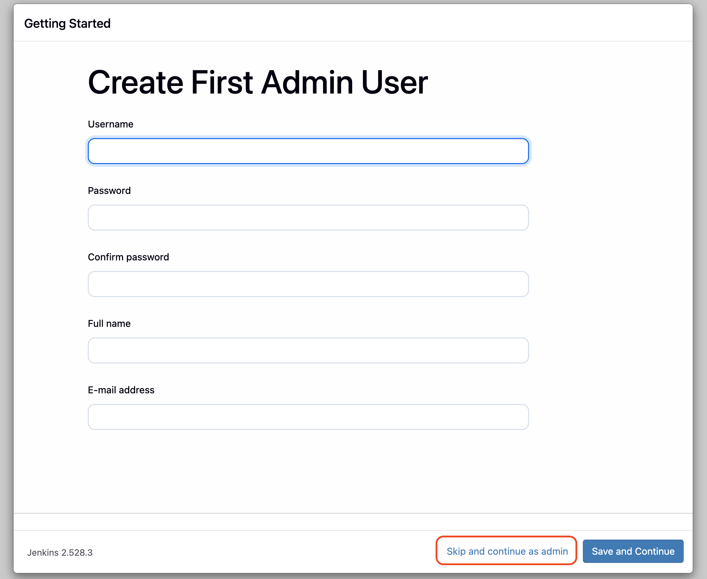
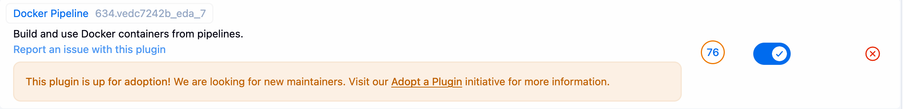
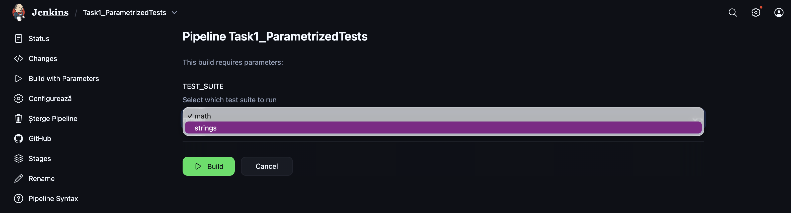
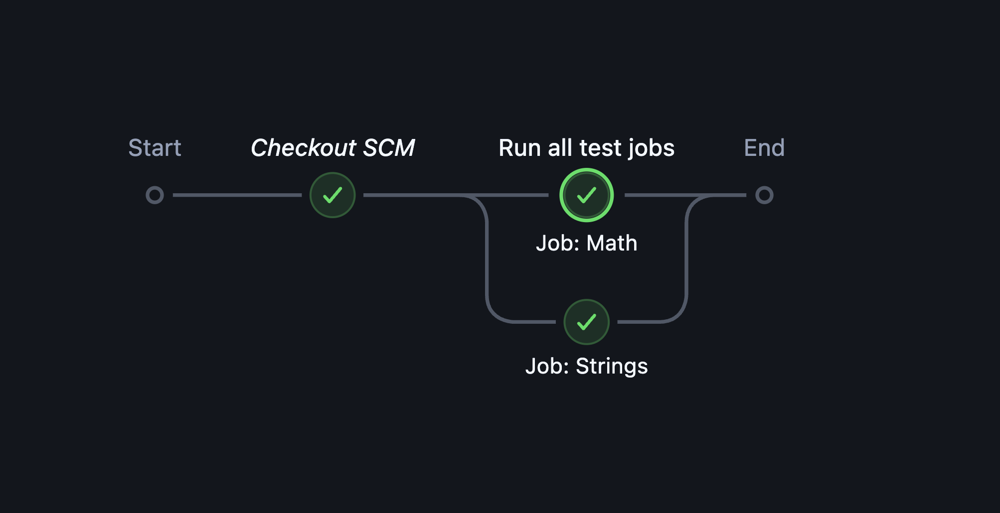

# Software Quality Management & Assurance

## Jenkins CI Assignment - Automated Testing with Dockerized Pipelines

**Student:** Zeek Liviu-Ioan  
**Repository:** SQMA_Zeek_Liviu-Ioan  
**GitHub URL:** https://github.com/zeekliviu/SQMA_Zeek_Liviu-Ioan

---

## 1. Introduction

This assignment focuses on the configuration and use of Jenkins as a Continuous Integration (CI) tool for automated testing.  
The objective is to demonstrate the use of **Pipeline as Code**, **parameterized builds**, and **multi-job pipelines**, using a fully **containerized Jenkins environment**.

All components, including the Jenkins server and the pipelines, are configured in a reproducible manner, following Infrastructure as Code principles.

---

## 2. Jenkins Environment Setup (Dockerized)

### 2.1 Rationale for Using Docker

Jenkins was deployed using Docker in order to:

- avoid installing Jenkins directly on the host system,
- ensure environment reproducibility,
- keep the CI infrastructure isolated and self-contained.

This approach aligns with modern CI/CD best practices and facilitates portability.

---

### 2.2 Docker Compose Configuration

The Jenkins infrastructure is stored in the `jenkins/` directory of the repository.

**File:** `jenkins/docker-compose.yml`

```yaml
services:
  jenkins:
    image: jenkins/jenkins:lts-jdk17
    container_name: jenkins
    user: root
    ports:
      - "8080:8080"
      - "50000:50000"
    volumes:
      - jenkins_home:/var/jenkins_home
      - /var/run/docker.sock:/var/run/docker.sock
    restart: unless-stopped

volumes:
  jenkins_home:
```

---

### 2.3 Jenkins Initialization

Jenkins was started using the following command:

```bash
docker compose up -d
```

The initial administrator password was retrieved using:

```bash
docker exec -it jenkins cat /var/jenkins_home/secrets/initialAdminPassword
```



The default administrator account was used, as the environment is local and isolated.

---

### 2.4 Plugin Installation

The following plugins were installed:

- Pipeline
- Git
- GitHub

I had to manually install the "Docker Pipeline" plugin to enable Docker agent support in pipelines.



---

## 3. Repository Structure

```
SQMA_Zeek_Liviu-Ioan/
├── tests/
│   ├── test_math.py
│   ├── test_strings.py
│   └── requirements.txt
├── Jenkinsfile.task1
├── Jenkinsfile.math
├── Jenkinsfile.strings
├── Jenkinsfile.task2
├── jenkins-sqma/
│   └── docker-compose.yml
├── SQMA_Jenkins_Report.pdf
└── SQMA_Jenkins_Report.md
```

---

## 4. Task 1 – Parameterized Jenkins Job

### 4.1 Objective

Create a Jenkins job that connects to the GitHub repository and allows the user to select which test suite to run via a parameter.

---

### 4.2 Jenkinsfile.task1

The pipeline defines a `TEST_SUITE` parameter and executes tests inside a Docker container.

The task can be found [here](./Jenkinsfile.task1).

---

### 4.3 Job Configuration

- Type: Pipeline
- Definition: Pipeline script from SCM
- Script Path: `Jenkinsfile.task1`


The `This build is parameterized` option was automatically enabled due to the presence of parameters in the Jenkinsfile.

---

### 4.4 Execution Results

Two executions were performed:

- `TEST_SUITE = math`
- `TEST_SUITE = strings`



Console Output for `math` tests:

```
Started by user admin

Obtained Jenkinsfile.task1 from git https://github.com/zeekliviu/SQMA_Zeek_Liviu-Ioan.git
[Pipeline] Start of Pipeline
[Pipeline] node
Running on Jenkins
 in /var/jenkins_home/workspace/Task1_ParametrizedTests
[Pipeline] {
[Pipeline] stage
[Pipeline] { (Declarative: Checkout SCM)
[Pipeline] checkout
Selected Git installation does not exist. Using Default
The recommended git tool is: NONE
No credentials specified
 > git rev-parse --resolve-git-dir /var/jenkins_home/workspace/Task1_ParametrizedTests/.git # timeout=10
Fetching changes from the remote Git repository
 > git config remote.origin.url https://github.com/zeekliviu/SQMA_Zeek_Liviu-Ioan.git # timeout=10
Fetching upstream changes from https://github.com/zeekliviu/SQMA_Zeek_Liviu-Ioan.git
 > git --version # timeout=10
 > git --version # 'git version 2.47.3'
 > git fetch --tags --force --progress -- https://github.com/zeekliviu/SQMA_Zeek_Liviu-Ioan.git +refs/heads/*:refs/remotes/origin/* # timeout=10
 > git rev-parse refs/remotes/origin/main^{commit} # timeout=10
Checking out Revision f45152a8a44e92372246a807458feb3c8b8c4102 (refs/remotes/origin/main)
 > git config core.sparsecheckout # timeout=10
 > git checkout -f f45152a8a44e92372246a807458feb3c8b8c4102 # timeout=10
Commit message: "chore: added compose for containerized jenkins"
 > git rev-list --no-walk f45152a8a44e92372246a807458feb3c8b8c4102 # timeout=10
[Pipeline] }
[Pipeline] // stage
[Pipeline] withEnv
[Pipeline] {
[Pipeline] stage
[Pipeline] { (Checkout)
[Pipeline] checkout
Selected Git installation does not exist. Using Default
The recommended git tool is: NONE
No credentials specified
 > git rev-parse --resolve-git-dir /var/jenkins_home/workspace/Task1_ParametrizedTests/.git # timeout=10
Fetching changes from the remote Git repository
 > git config remote.origin.url https://github.com/zeekliviu/SQMA_Zeek_Liviu-Ioan.git # timeout=10
Fetching upstream changes from https://github.com/zeekliviu/SQMA_Zeek_Liviu-Ioan.git
 > git --version # timeout=10
 > git --version # 'git version 2.47.3'
 > git fetch --tags --force --progress -- https://github.com/zeekliviu/SQMA_Zeek_Liviu-Ioan.git +refs/heads/*:refs/remotes/origin/* # timeout=10
 > git rev-parse refs/remotes/origin/main^{commit} # timeout=10
Checking out Revision f45152a8a44e92372246a807458feb3c8b8c4102 (refs/remotes/origin/main)
 > git config core.sparsecheckout # timeout=10
 > git checkout -f f45152a8a44e92372246a807458feb3c8b8c4102 # timeout=10
Commit message: "chore: added compose for containerized jenkins"
[Pipeline] }
[Pipeline] // stage
[Pipeline] stage
[Pipeline] { (Run selected tests)
[Pipeline] node
Running on Jenkins
 in /var/jenkins_home/workspace/Task1_ParametrizedTests@2
[Pipeline] {
[Pipeline] checkout
Selected Git installation does not exist. Using Default
The recommended git tool is: NONE
No credentials specified
 > git rev-parse --resolve-git-dir /var/jenkins_home/workspace/Task1_ParametrizedTests@2/.git # timeout=10
Fetching changes from the remote Git repository
 > git config remote.origin.url https://github.com/zeekliviu/SQMA_Zeek_Liviu-Ioan.git # timeout=10
Fetching upstream changes from https://github.com/zeekliviu/SQMA_Zeek_Liviu-Ioan.git
 > git --version # timeout=10
 > git --version # 'git version 2.47.3'
 > git fetch --tags --force --progress -- https://github.com/zeekliviu/SQMA_Zeek_Liviu-Ioan.git +refs/heads/*:refs/remotes/origin/* # timeout=10
 > git rev-parse refs/remotes/origin/main^{commit} # timeout=10
Checking out Revision f45152a8a44e92372246a807458feb3c8b8c4102 (refs/remotes/origin/main)
 > git config core.sparsecheckout # timeout=10
 > git checkout -f f45152a8a44e92372246a807458feb3c8b8c4102 # timeout=10
Commit message: "chore: added compose for containerized jenkins"
[Pipeline] withEnv
[Pipeline] {
[Pipeline] isUnix
[Pipeline] withEnv
[Pipeline] {
[Pipeline] sh
+ docker inspect -f . python:3.12-slim
.
[Pipeline] }
[Pipeline] // withEnv
[Pipeline] withDockerContainer
Jenkins seems to be running inside container a70d8f72071db2cdf33a2cc757177d3d7d103b674a4715d58a677f01b407bb2b
$ docker run -t -d -u 0:0 -u root:root -w /var/jenkins_home/workspace/Task1_ParametrizedTests@2 --volumes-from a70d8f72071db2cdf33a2cc757177d3d7d103b674a4715d58a677f01b407bb2b -e ******** -e ******** -e ******** -e ******** -e ******** -e ******** -e ******** -e ******** -e ******** -e ******** -e ******** -e ******** -e ******** -e ******** -e ******** -e ******** -e ******** -e ******** -e ******** -e ******** -e ******** -e ******** -e ******** -e ******** -e ******** -e ******** -e ******** -e ******** -e ******** -e ******** -e ******** -e ******** python:3.12-slim cat
$ docker top c85b58d3c9bb25330e1faa4947c00f0a4813faf89bc9dae99ccd82882ebe4217 -eo pid,comm
[Pipeline] {
[Pipeline] sh
+ python --version
Python 3.12.12
+ pip install -r tests/requirements.txt
Collecting pytest (from -r tests/requirements.txt (line 1))
  Downloading pytest-9.0.2-py3-none-any.whl.metadata (7.6 kB)
Collecting iniconfig>=1.0.1 (from pytest->-r tests/requirements.txt (line 1))
  Downloading iniconfig-2.3.0-py3-none-any.whl.metadata (2.5 kB)
Collecting packaging>=22 (from pytest->-r tests/requirements.txt (line 1))
  Downloading packaging-25.0-py3-none-any.whl.metadata (3.3 kB)
Collecting pluggy<2,>=1.5 (from pytest->-r tests/requirements.txt (line 1))
  Downloading pluggy-1.6.0-py3-none-any.whl.metadata (4.8 kB)
Collecting pygments>=2.7.2 (from pytest->-r tests/requirements.txt (line 1))
  Downloading pygments-2.19.2-py3-none-any.whl.metadata (2.5 kB)
Downloading pytest-9.0.2-py3-none-any.whl (374 kB)
Downloading iniconfig-2.3.0-py3-none-any.whl (7.5 kB)
Downloading packaging-25.0-py3-none-any.whl (66 kB)
Downloading pluggy-1.6.0-py3-none-any.whl (20 kB)
Downloading pygments-2.19.2-py3-none-any.whl (1.2 MB)
   ---------------------------------------- 1.2/1.2 MB 3.9 MB/s eta 0:00:00
Installing collected packages: pygments, pluggy, packaging, iniconfig, pytest
Successfully installed iniconfig-2.3.0 packaging-25.0 pluggy-1.6.0 pygments-2.19.2 pytest-9.0.2
WARNING: Running pip as the 'root' user can result in broken permissions and conflicting behaviour with the system package manager, possibly rendering your system unusable. It is recommended to use a virtual environment instead: https://pip.pypa.io/warnings/venv. Use the --root-user-action option if you know what you are doing and want to suppress this warning.

[notice] A new release of pip is available: 25.0.1 -> 25.3
[notice] To update, run: pip install --upgrade pip
+ [ math = math ]
+ pytest -q tests/test_math.py
..                                                                       [100%]
2 passed in 0.00s
[Pipeline] }
$ docker stop --time=1 c85b58d3c9bb25330e1faa4947c00f0a4813faf89bc9dae99ccd82882ebe4217
$ docker rm -f --volumes c85b58d3c9bb25330e1faa4947c00f0a4813faf89bc9dae99ccd82882ebe4217
[Pipeline] // withDockerContainer
[Pipeline] }
[Pipeline] // withEnv
[Pipeline] }
[Pipeline] // node
[Pipeline] }
[Pipeline] // stage
[Pipeline] stage
[Pipeline] { (Declarative: Post Actions)
[Pipeline] echo
Finished Task 1 job with TEST_SUITE=math
[Pipeline] }
[Pipeline] // stage
[Pipeline] }
[Pipeline] // withEnv
[Pipeline] }
[Pipeline] // node
[Pipeline] End of Pipeline
Finished: SUCCESS
```

---

## 5. Task 2 – Multi-Job Pipeline

### 5.1 Objective

Create multiple Jenkins jobs and orchestrate them using a master pipeline that runs all tests in parallel.

---

### 5.2 Individual Test Jobs

- `Task2_TestMath` → `Jenkinsfile.math`
- `Task2_TestStrings` → `Jenkinsfile.strings`

Each job runs its corresponding test suite inside a Docker container.

The configurations are similar to Task 1, but without parameters.

---

### 5.3 Master Pipeline

**File:** `Jenkinsfile.task2`

This pipeline triggers both test jobs in parallel.

The task can be found [here](./Jenkinsfile.task2).

---

### 5.4 Execution Results

The master pipeline was executed successfully, running both test jobs in parallel.



Console Output for the master pipeline:

```
Started by user admin

Obtained Jenkinsfile.task2 from git https://github.com/zeekliviu/SQMA_Zeek_Liviu-Ioan.git
[Pipeline] Start of Pipeline
[Pipeline] node
Running on Jenkins
 in /var/jenkins_home/workspace/Task2_AllTestsPipeline
[Pipeline] {
[Pipeline] stage
[Pipeline] { (Declarative: Checkout SCM)
[Pipeline] checkout
Selected Git installation does not exist. Using Default
The recommended git tool is: NONE
No credentials specified
Cloning the remote Git repository
Cloning repository https://github.com/zeekliviu/SQMA_Zeek_Liviu-Ioan.git
 > git init /var/jenkins_home/workspace/Task2_AllTestsPipeline # timeout=10
Fetching upstream changes from https://github.com/zeekliviu/SQMA_Zeek_Liviu-Ioan.git
 > git --version # timeout=10
 > git --version # 'git version 2.47.3'
 > git fetch --tags --force --progress -- https://github.com/zeekliviu/SQMA_Zeek_Liviu-Ioan.git +refs/heads/*:refs/remotes/origin/* # timeout=10
 > git config remote.origin.url https://github.com/zeekliviu/SQMA_Zeek_Liviu-Ioan.git # timeout=10
 > git config --add remote.origin.fetch +refs/heads/*:refs/remotes/origin/* # timeout=10
Avoid second fetch
 > git rev-parse refs/remotes/origin/main^{commit} # timeout=10
Checking out Revision 310c440d7880ed527ca96ef9ab7b70e464743bd7 (refs/remotes/origin/main)
 > git config core.sparsecheckout # timeout=10
 > git checkout -f 310c440d7880ed527ca96ef9ab7b70e464743bd7 # timeout=10
Commit message: "chore: fixed paths... again"
First time build. Skipping changelog.
[Pipeline] }
[Pipeline] // stage
[Pipeline] withEnv
[Pipeline] {
[Pipeline] stage
[Pipeline] { (Run all test jobs)
[Pipeline] parallel
[Pipeline] { (Branch: Job: Math)
[Pipeline] { (Branch: Job: Strings)
[Pipeline] stage
[Pipeline] { (Job: Math)
[Pipeline] stage
[Pipeline] { (Job: Strings)
[Pipeline] build (Building Task2_TestMath)
Scheduling project: Task2_TestMath

[Pipeline] build (Building Task2_TestStrings)
Scheduling project: Task2_TestStrings

Starting building: Task2_TestMath #3

Starting building: Task2_TestStrings #2

Build Task2_TestStrings #2
 completed: SUCCESS
[Pipeline] }
[Pipeline] // stage
[Pipeline] }
Build Task2_TestMath #3
 completed: SUCCESS
[Pipeline] }
[Pipeline] // stage
[Pipeline] }
[Pipeline] // parallel
[Pipeline] }
[Pipeline] // stage
[Pipeline] }
[Pipeline] // withEnv
[Pipeline] }
[Pipeline] // node
[Pipeline] End of Pipeline
Finished: SUCCESS
```

---

## 6. Conclusions

This assignment demonstrates:

- the use of Jenkins pipelines defined as code,
- parameterized builds for controlled test execution,
- Docker-based agents for isolated and reproducible environments,
- orchestration of multiple jobs using a master pipeline.

The implemented solution follows modern CI principles and ensures clarity, reproducibility, and maintainability.
